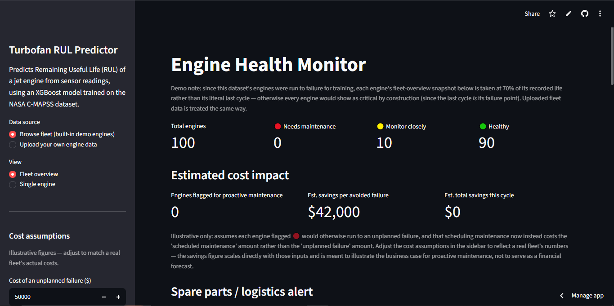
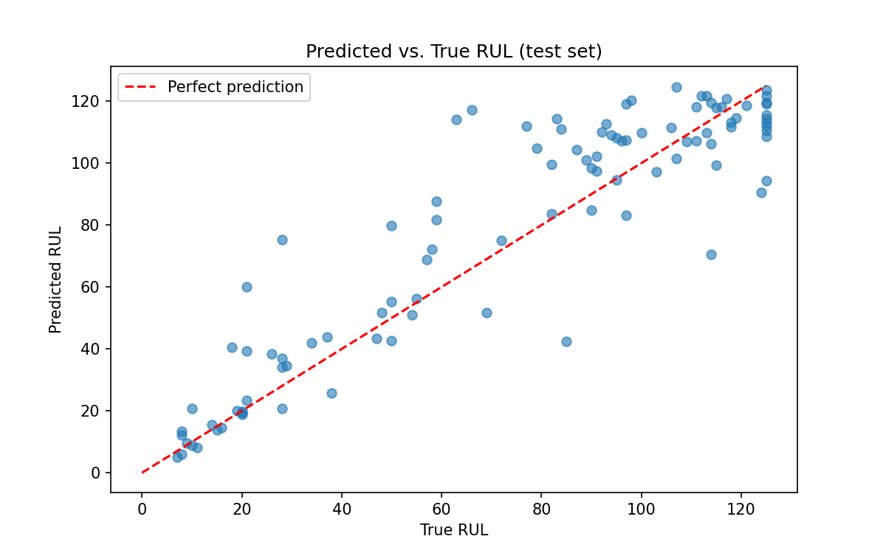
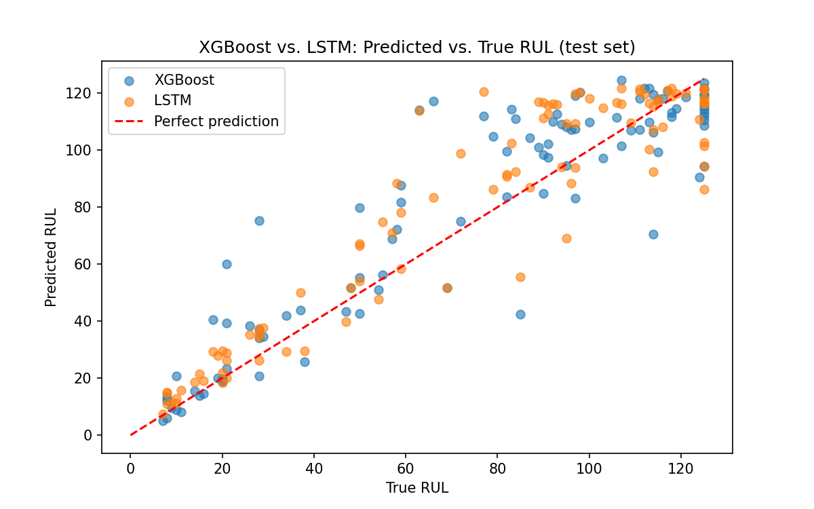
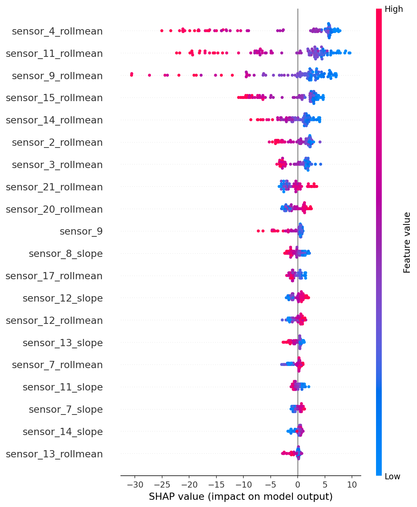

# Predictive Maintenance for Industrial Equipment: Turbofan Engine Case Study

Predicts Remaining Useful Life (RUL) of industrial rotating machinery from
multivariate sensor data, using aircraft turbofan engines (NASA C-MAPSS,
FD001) as the case study, with an explainable XGBoost model and a live
monitoring dashboard.

**[Live demo →](https://turbofan-predictive-maintenance-fqcznocxxcyi8aitt2dqjd.streamlit.app/)**



## Problem

Unplanned equipment failure is expensive and, in many industrial settings,
potentially dangerous. Predictive maintenance uses sensor data collected
over an asset's operating life to estimate how much useful life remains,
so maintenance can be scheduled proactively instead of reactively — this
applies broadly to rotating machinery: motors, pumps, turbines,
compressors, and aircraft engines alike.

This project uses **turbofan jet engines as a case study**: a
well-benchmarked example of complex rotating machinery that degrades
gradually and is instrumented with multivariate sensors, the same shape of
problem found across industrial equipment. It predicts RUL (in operating
cycles) for a fleet of simulated turbofan engines using the NASA C-MAPSS
FD001 subset — 100 training engines run to failure, 100 test engines
truncated at a random point before failure.

## Approach

- **Piecewise RUL target**: RUL is capped at 125 cycles early in an engine's
  life, since degradation isn't meaningfully predictable from healthy sensor
  readings alone — this is standard practice on this dataset and avoids
  penalizing the model for early-life noise.
- **Feature engineering**: rolling mean/std and a linear degradation slope
  per sensor, computed over a sliding window, on top of the raw sensor
  readings. Near-constant sensors (no variance across the fleet) were
  dropped.
- **Models compared**: a Linear Regression baseline, a tuned XGBoost regressor
  (RandomizedSearchCV + GroupKFold cross-validation, grouped by engine ID to
  avoid leakage across folds), and an LSTM trained directly on raw sensor
  sequences (no hand-engineered features) to test whether a sequence model
  captures degradation patterns the engineered features miss.
- **Evaluation metric**: RMSE alone is misleading here — a model that
  predicts *more* remaining life than an engine actually has is far more
  dangerous than one that's conservative. I used the NASA prognostics
  challenge's asymmetric scoring function, which penalizes late predictions
  exponentially more than early ones, alongside RMSE.
- **Explainability**: SHAP values show which sensors/features drove each
  individual prediction — important in a maintenance context, where an
  engineer needs to know *why* a model is flagging risk, not just the score.

## Results

| Model | RMSE | NASA Score |
|---|---|---|
| Linear Regression (baseline) | 20.517 | 1104.7 |
| XGBoost (tuned) | 16.978 | 820.1 |
| LSTM (raw sequences) | 15.266 | 527.3 |

For context, published benchmarks on FD001 with tabular/tree-based models
typically fall in the RMSE ~15–20 range — see `results_table.csv` for exact
numbers from this run.

**The LSTM meaningfully outperformed XGBoost on both metrics** (~10% lower
RMSE, ~36% lower NASA score) — a genuine finding, not a marginal difference.
Despite this, **XGBoost was chosen as the deployed model** for the
dashboard, for a deliberate reason: the explainability features this
project relies on (SHAP feature attribution, the component-diagnosis
mapping, and the safe-operating-window calibration) all depend on a
tree-based model, and building equivalent explainability for a sequence
model was out of scope for this project's timeline. This is a real
engineering tradeoff — raw accuracy versus interpretability — reported
honestly rather than glossed over.




## Safe operating window calibration

Using cross-validated residuals (see notebook Step 17), the safety margin
at 95% confidence came out to **35.3 cycles**, validated at **96.0%
coverage** on the held-out test set — very close to the 95% target,
indicating the calibration is behaving as intended rather than being
arbitrarily loose or tight.

## Explainability



The top contributing features are consistent with known degradation
patterns in this dataset (sensors tracking temperature and pressure ratios
trend most strongly toward failure).

## Dashboard

The Streamlit app (`app.py`) has two views:
- **Fleet overview** — all engines ranked by predicted risk, summary counts
  (healthy / monitor / needs maintenance), a fleet-wide RUL chart, an
  adjustable cost-savings estimate, and a spare-parts/logistics alert (see
  below).
- **Single engine** — pick one engine, see its sensor trends over its
  lifetime, a live RUL prediction with a risk flag, a conservative safe
  operating floor, a schedule-compatibility check, a SHAP explanation, a
  component-level diagnosis with suggested inspection actions, and a
  one-click PDF maintenance report.

You can also upload your own CSV (same column schema as the raw C-MAPSS
files) instead of browsing the built-in demo engines.

### Maintenance decision-support features

These go beyond a raw prediction to answer the questions a maintenance
engineer would actually ask:

- **Component diagnosis** — SHAP identifies which sensors are driving a
  given prediction; those sensors are mapped to the physical subsystem
  they measure (e.g., HPC outlet pressure → High-Pressure Compressor) using
  sensor descriptions published in Saxena & Goebel (2008), the original
  C-MAPSS paper. FD001 engines in this dataset fail via a single documented
  mode (HPC degradation), so this mapping is grounded in the dataset's own
  documentation, not invented. Each flagged subsystem comes with a plausible
  next inspection step (e.g., "perform borescope inspection of HPC blades").
- **Safe operating window** — instead of a single point estimate, the
  dashboard also shows a conservative floor: "predicted RUL: 25, but safe
  for at least 16 cycles at 95% confidence." This is computed from
  cross-validated residuals (see notebook Step 17) — specifically, the 95th
  percentile of how much the model has historically *overpredicted* on
  held-out folds, subtracted from the point prediction.
- **Schedule compatibility check** — compares a user-entered number of
  upcoming cycles (e.g., "3 more flights before the next depot visit")
  against the safe floor, not the raw prediction, and gives a clear
  yes/no answer.
- **Spare parts / logistics alert** (fleet view) — flags any engine whose
  safe floor is at or below an assumed parts lead time (adjustable in the
  sidebar), signaling that an order placed today may not arrive in time.
- **Exportable PDF report** — a one-click download summarizing an engine's
  status, safe floor, and suggested inspection points, meant to be handed
  off at a shift change or attached to a work order.

All of these are clearly labeled as illustrative/assumption-driven where
appropriate (cost figures, parts lead time) or as simplified statistical
estimates (the safety margin) — see the caveats shown directly in the
dashboard and in Limitations below.

## Project structure

```
├── predictive_maintenance.ipynb   # full pipeline: data → features → model → SHAP
├── app.py                         # Streamlit dashboard
├── requirements.txt
├── model.pkl                      # trained model (exported from the notebook)
├── feature_cols.json              # feature list used at inference time
├── sensor_cols.json               # sensor columns used for feature engineering
├── dashboard_data.csv             # per-engine sensor history for the dashboard
├── safety_margin.json             # calibrated safe-operating-window margin (Step 17)
└── results_table.csv, *.png       # saved results and plots
```

## Running locally

```bash
pip install -r requirements.txt
streamlit run app.py
```

## Does this generalize to other machines?

The *technique* — sensor-trend feature engineering, a piecewise RUL target,
an asymmetric cost-aware evaluation metric, SHAP explainability — applies to
any asset that degrades gradually and has sensor telemetry (bearings,
pumps, wind turbines, batteries). The *trained model itself* does not: it
learned patterns specific to this exact 21-sensor jet engine schema and
this dataset's simulated operating condition.

The dashboard lets you upload your own CSV of engine data (same column
schema as the raw C-MAPSS files) and get live predictions on it — so it's
not limited to the 100 pre-loaded demo engines. It cannot, however, take
data from a genuinely different machine type or sensor layout; that would
require retraining the pipeline on that machine's own dataset from
scratch. Applying this to real (non-simulated) jet engines would also
likely require retraining, since C-MAPSS is a physics-based simulation,
not real fleet data.

## Limitations & next steps

- Trained only on the FD001 subset (single operating condition, single
  fault mode). The other C-MAPSS subsets introduce multiple operating
  conditions and fault modes, which would need more feature engineering.
- An LSTM was trained on raw sensor sequences as a comparison point against
  the engineered-feature XGBoost approach (see results table above and the
  notebook's "Extension" section for the full comparison and discussion).
- A 1D-CNN or a transformer-based sequence model could be tried as a
  further comparison point.
- The safe-operating-window margin is a simplified percentile-based
  estimate from cross-validated residuals, not a rigorous statistical
  prediction interval (e.g., conformal prediction) — it's a reasonable
  approximation for this project's scope, not a certified safety bound.
- The component diagnosis maps sensors to subsystems using published
  dataset documentation, but the suggested inspection actions are
  illustrative, plausible next steps, not a substitute for an actual
  maintenance manual or engineer judgment.
- This is an educational project using a public benchmark dataset — not
  validated for real-world maintenance decisions.

## Dataset

[NASA C-MAPSS Turbofan Engine Degradation Simulation Dataset](https://www.nasa.gov/intelligent-systems-division/discovery-and-systems-health/pcoe/pcoe-data-set-repository/)

Sensor descriptions used for the component diagnosis feature are from:
A. Saxena and K. Goebel, "Turbofan Engine Degradation Simulation Data Set,"
NASA Ames Prognostics Data Repository, NASA Ames Research Center, 2008.
