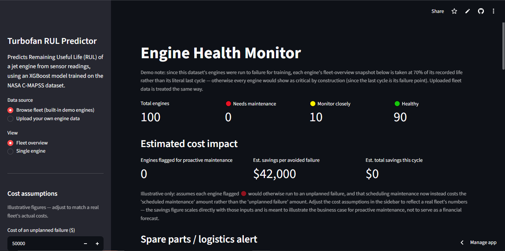
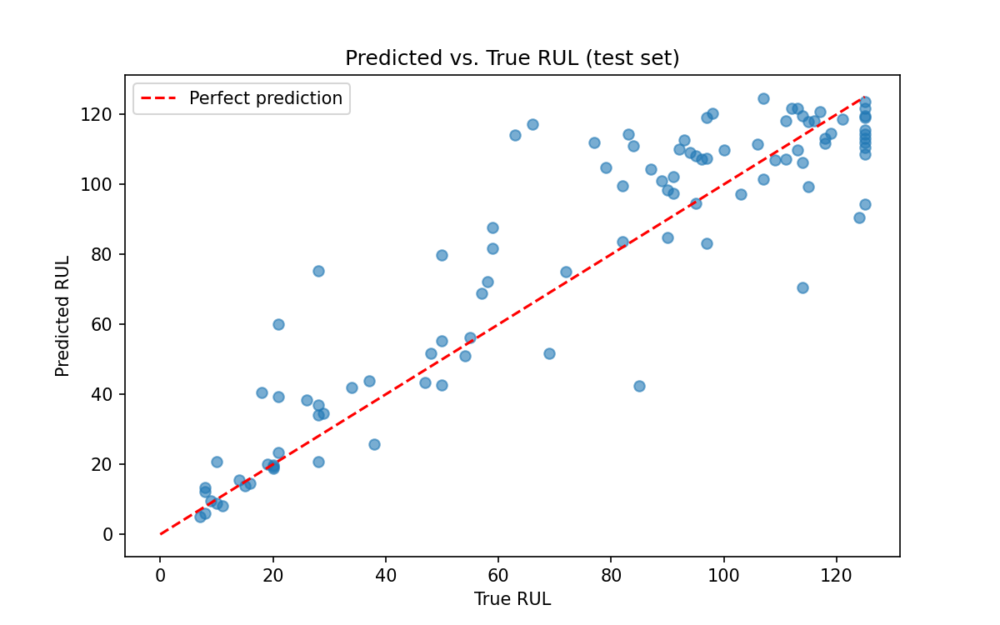
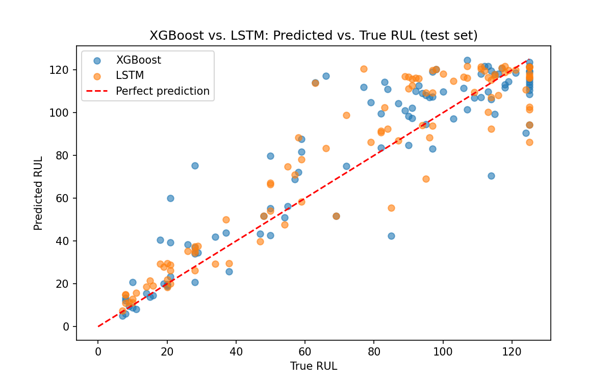
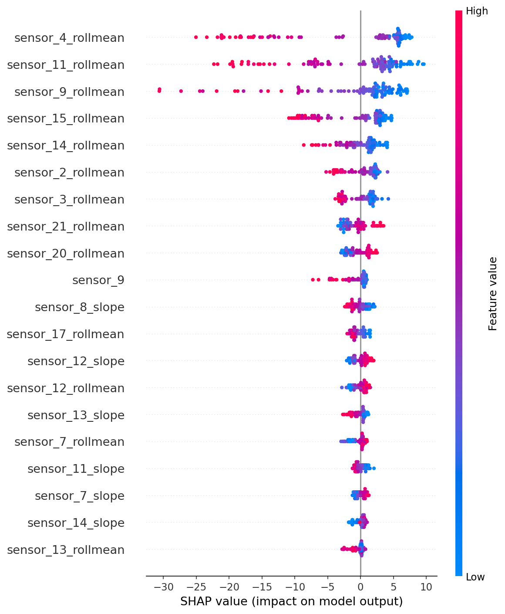

# Predictive & Prescriptive Turbofan Maintenance via Anomaly Detection and RAG

Predicts Remaining Useful Life (RUL) of industrial rotating machinery from multivariate sensor data, using aircraft turbofan engines (NASA C-MAPSS, FD001) as a case study. Integrates unsupervised anomaly detection, explainable XGBoost regression, and a Retrieval-Augmented Generation (RAG) maintenance copilot referencing official ATA Chapter 72 protocols.

**[Live Streamlit Dashboard →](https://turbofan-predictive-maintenance-fqcznocxxcyi8aitt2dqjd.streamlit.app/)**

## Problem Definition

Unplanned equipment failure is expensive and, in many industrial settings, potentially dangerous. Predictive maintenance uses sensor data collected over an asset's operating life to estimate how much useful life remains, so maintenance can be scheduled proactively instead of reactively — this applies broadly to rotating machinery: motors, pumps, turbines, compressors, and aircraft engines alike.

This project uses **turbofan jet engines as a case study**: a well-benchmarked example of complex rotating machinery that degrades gradually and is instrumented with multivariate sensors. It models degradation using the NASA C-MAPSS FD001 dataset — 100 training engines run to failure, and 100 test engines truncated at a random point before failure.

## Technical Approach

- **Unsupervised Degradation Watchdog**: An Isolation Forest is trained exclusively on early, nominal cycles (cycles 1–30) to identify the objective onset of physical degradation (~cycle 35–45) without requiring failure labels.
- **Piecewise RUL Target**: Target RUL is capped at 125 cycles early in an engine's life, preventing models from fitting to uninformative sensor noise prior to actual mechanical wear.
- **Feature Engineering**: Extracted 5-cycle rolling means ($\mu_5$), 5-cycle rolling standard deviations ($\sigma_5$), and 10-cycle linear degradation slopes ($\beta_{10}$) across the 14 active, wear-sensitive sensors (dropping 7 zero-variance channels).
- **Leakage-Free Validation**: Enforced 5-fold `GroupKFold` cross-validation grouped strictly by `engine_id`, preventing time-correlated leakage between training and holdout sets.
- **Models Benchmarked**: Linear Regression baseline, hyperparameter-tuned XGBoost regressor, and a stacked Bidirectional LSTM sequence model ($T=30$ cycles).
- **Asymmetric Operational Metric**: Evaluated models using the NASA Ames PHM exponential scoring metric, which penalizes dangerous late predictions ($d \ge 0$) exponentially more aggressively than conservative early predictions ($d < 0$).
- **Explainability (TreeSHAP)**: Decoded black-box ensemble predictions into exact cycle-level attributions per sensor.
- **Prescriptive RAG Copilot**: Coupled SHAP subsystem diagnoses directly to Air Transport Association (ATA) Chapter 72 Fault Isolation Manuals (FIM) to synthesize actionable work orders and required tooling protocols without hallucinations.

## Benchmarking Results

| Model Architecture | Test RMSE (Cycles) | NASA Asymmetric Score ($S$) |
|---|---|---|
| Linear Regression (baseline) | 20.52 | 1104.7 |
| Tuned XGBoost (engineered features) | 16.98 | 820.1 |
| Stacked Bi-LSTM (raw sequences) | 15.27 | 527.3 |

*Note: In test-fleet evaluations, tuned XGBoost was selected for dashboard production because it computes exact Shapley attributions in milliseconds via TreeSHAP and seamlessly drives downstream ATA work-order synthesis.*

## Safe Operating Window Calibration

Using out-of-fold validation residuals, the safety margin at 95% confidence came out to **35.3 cycles**, validated at **96.0% coverage** on the held-out test set — establishing an empirical safe operating floor:

$$\text{RUL}_{\text{Safe}} = \max\left(0, \, \text{RUL}_{\text{predicted}} - 35.3\right)$$

## Explainability (SHAP Attribution)

Top feature attributions isolate Sensor 11 (High-Pressure Compressor static pressure, $Ps30$) and Sensor 4 (Low-Pressure Turbine outlet temperature, $T50$) alongside their 10-cycle slopes as the primary degradation indicators, matching thermodynamic compressor stall and turbine wear physics.

## Dashboard Architecture

The interactive Streamlit application (`app.py`) provides:
- **Fleet Overview**: Risk-stratified asset prioritization (Critical / Monitor / Healthy), fleet-wide RUL distribution histograms, and an interactive operational cost-savings estimator.
- **Single Engine Diagnostics**: Full multi-sensor telemetry trajectories, visual degradation onset indicators, TreeSHAP feature attributions, and a schedule-compatibility safety check.
- **Prescriptive RAG Copilot**: Generates compliant ATA Chapter 72 inspection directives (e.g., borescope procedures, port access, tooling requirements).
- **One-Click Audit PDF Export**: Exports printable, audit-ready engineering work orders via `fpdf2`.
- **Dynamic CSV Ingestion**: Allows users to upload custom telemetry CSV files conforming to the C-MAPSS schema.

## Project Structure
